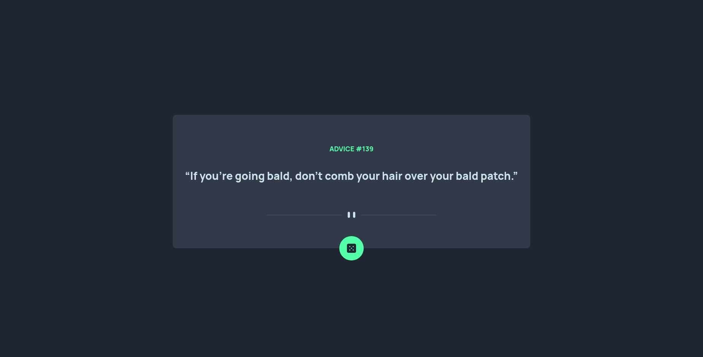

# Frontend Mentor - Advice generator app solution

As backend developer moving towards fullstack my main goal is getter better at frontend development.
My biggest challenge is responsive design. 

## Challenge
- Getter better at responsive design
- Getting better at CSS in general
- Think about html/css before writing
- WCAG compliance

## Tools
Just plain html/css and javascript(Basics first)

### Screenshot

### What I learned
I found CSS to be the most difficult part. 
I learned a lot about positioning and using different techniques like grid/flex.

### Difficulties
I still find CSS to be quite unpredictable as it behaves differently than I expect in some cases.
I need to do some more studying to better understand certain CSS behaviour especially the sizing of nested divs is quite confusing at times.
